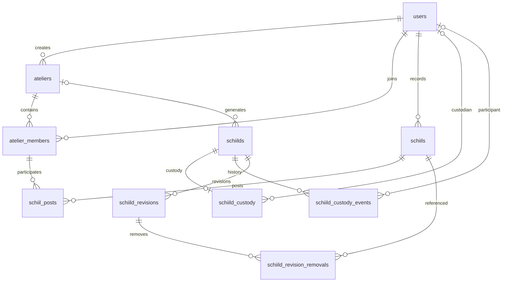

# Phase 1 ER

全生命作品はatelier_idがNULL。同じ日付のNULL同士もUNIQUEで重複を拒否する。
カバーは作品IDとアトリエIDの複合FKで同一アトリエの作品に制限する。
写真の1人1日制約、投稿の1アトリエ1人1日制約、生成の1アトリエ1日制約をDBに置く。
履歴行の物理削除は禁止。退会時の画像・区画の扱いは別の仕様判断であり、本スキーマから削除を推測して実装しない。
